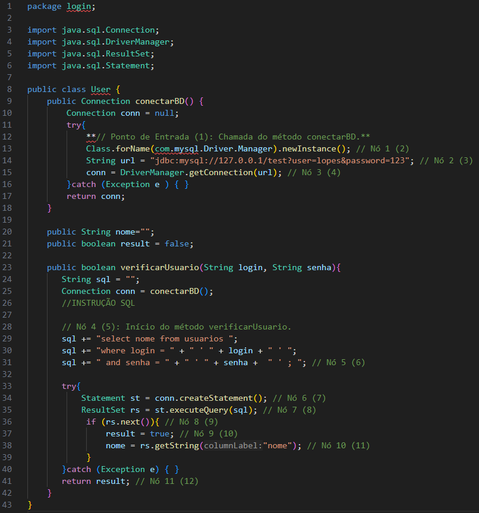
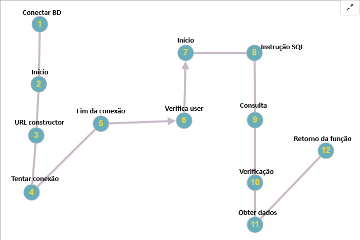

# Exercício individual - Testes Caixa Branca (ETAPA 1)

Teste 1 - Verificação do codigo para reallizar um Teste de Caixa Branca, conforme visto teoricamente na aula.

## Erros encontrados

<ol>
    <li>A DOCUMENTAÇÃO FOI DESCRITA NO CÓDIGO?
    
Não há documentação.

    </li>
    <li>AS VARIÁVEIS E CONSTANTES POSSUEM BOA NOMENCLATURA?
    
Não, as variáveis não seguem o padrão solicitado em Java (CamelCase) 

    </li>
    <li>EXISTEM LEGIBILIDADE E ORGANIZAÇÃO NO CÓDIGO?
    
Não há uma boa identação de código no projeto.

    </li>
    <li>TODOS OS NULLPOINTERS FORAM TRATADOS?
    
Não foram fechados corretamente, Se ocorrer um erro durante a conexão uma exceção será lançada, mas o código não trata essas exceções. 

    </li>
    <li>A ARQUITETURA UTILIZADA FOI DEVIDAMENTE RESPEITADA?
    

    </li>Não
    <li>AS CONEXÕES UTILIZADAS FORAM FECHADAS?
    
Não há fechamento nas conexões.

    </li>
</ol>

# Exercício individual -  Critérios de Caixa Branca (ETAPA 2) - (Grafo de Fluxo; Complexidade Ciclomática; Base de Caminhos)

# Código:

## Grafo de Fluxo

# Complexidade Ciclomática

V(G) = 11 - 10 + 3 = 4. >>> V(G) = 3 + 1 = 4.

#  Sequencia dos Caminhos

<ol>
    <li>Entrada >>> Conectar BD >>> URL >>> Tentativa de conexão >>> FIM</li>
    <li>Entrada >>> >>> verifica user >>> Início >>>  Instrução SQL >>> Consulta >>> Verificação >>> Obter dados >>> Retorno da função >> FIM</li>
</ol>
